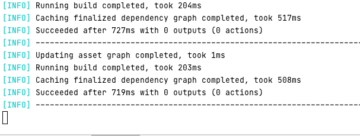

# Aplicacion web de un Control de Inventario en Dart - Angular

* [Dart](https://dart.dev)
* [AngularDart](https://angulardart.dev/guide)

### Preparar Enterno

1. [Instalar Dart](https://dart.dev/get-dart)
2. [Instalar Webdev](https://dart.dev/tools/webdev)
3. [Instalar stagehand](https://pub.dev/packages/stagehand)
4. Crear proyecto

```shell
mkdir inventory-dart-angular
cd inventory-dart-angular
inventory-dart-angular/stahehand web-angular
 ```

5. Descargar librerías desde Pub

```shell
inventory-dart-angular/pub get
 ```

6. Deployment en localhost con Webdev

```shell
inventory-dart-angular/webdev serve
 ```



